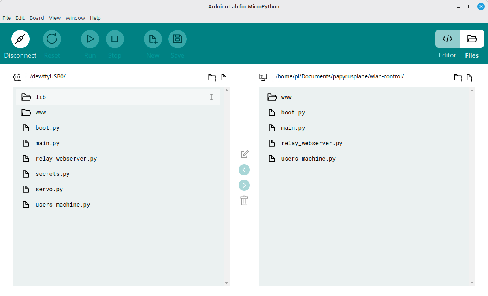
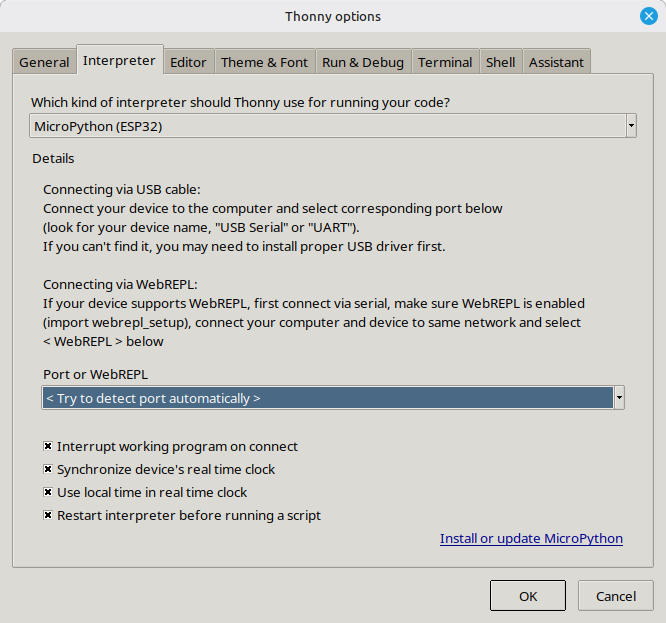
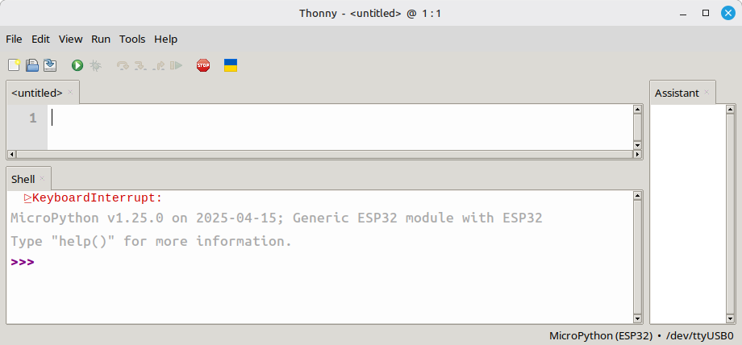

# arduino-lab-micropython-ide

 ---
## IDE using Arduino




## IDE using Thonny






<!--

# Headings
# H1
## H2
### H3
#### H4

# Text formatting
*italic*        _italic_
**bold**        __bold__
~~strikethrough~~
`inline code`

# Links
[title](https://example.com)

# Images


# Lists
- item
- item

1. first
2. second

# Nested lists
- item
  - subitem

# Task lists
- [ ] todo
- [x] done

# Blockquotes
> quote line
> another line

# Horizontal rule
---

# Code blocks
```js
console.log("hi");

-->